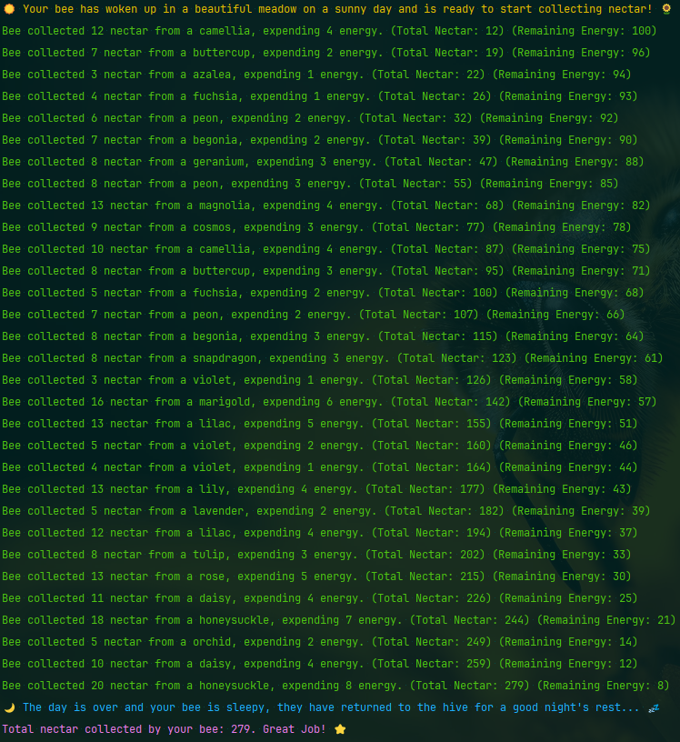

# Bee Simulator - 0/1 Knapsack Problem & Recursion Demonstration 🐝🌻



Simple example of the knapsack problem solved with a recursive algorithm, using a fun and whimsical CLI idle game/simulation about a nectar collecting bee!

Polynomial-time **(𝑂(𝑛 × 𝑚)) implementation (n = number of flowers, m = max energy)**

## Objective
Maximize the amount of nectar a bee can harvest in a day without exceeding its available energy.

## Constraints
1. Each flower provides a fixed amount of nectar
2. Each flower requires a fixed amount of energy to visit
3. The bee has a fixed amount of energy to spend
4. The bee can only visit each flower once
5. The bee can only carry a fixed amount of nectar
6. The bee must collect all nectar from a flower or none at all (0/1)

## Key Concepts
- Recursion
- Dynamic Programming
- Memoization
- Knapsack Problem
- Backtracking

## Run In Docker
For a quick and easy way to run the simulation, you can use Docker. All you need to do is run the Dockerfile and after building, the simulation will run automatically and output live results to your terminal.
```bash
docker-compose up
```
When you are done, you can stop the container with:
```bash
docker-compose down
```


## Install & Dependencies
You'll ideally want Python 3.12 or later to run this project.

Run the following to install dependencies:
```bash 
  pip install -r requirements.txt
```
(Or on Windows)
```bash
  py -m pip install pip install -r requirements.txt
```

## Usage
To run the simulation, execute the main script file:
```bash
py main.py
```

### Simulation Speed
The simulation speed can be adjusted by setting the `SPEED` environment variable. The smallest possible value is 0, which will run the simulation instantaneously. The default value is 1.

### Debugging
When running the main script file, set the DEBUG environment variable to `1` to enable debugging output.

### Tests
To run the tests, execute the test script file:
```bash
py -m unittest tests/test.py
```
**These tests evaluate the DP and traceback matrices against previously stored versions. If you adjust the code in a way so that the matrices have changed shape, the tests will fail. You must run the references file to update these. You should calculate the tiny_meadow flower set using an online knapsack tool or by hand and compare this with the table generated by Bee Simulator to ensure it is safe to regenerate the references. You can see the tiny_meadow DP and Traceback tables in the console by running the tests above**
```bash
py tests/references.py
```

## Directory Structure
- `tests/` - Test files
  - `matrices/` - Reference DP and Traceback tables stored as binary .npy files, which are easily restored into 2D arrays and compared in tests
  - `references.py` - Generates reference DP and Traceback tables and provides helpers for evaluating them in test cases
- `beesim.py` - Primary simulation logic. Including the recursive algorithm for solving the knapsack problem
- `flowers.py` - Arrays of flowers for the bee to collect nectar from, try making your own! (Adjusting the tiny_meadows or hundred_meadow will break the tests, be sure to revert changes to these if you plan on committing!)
- `helpers.py` - Helper functions
- `main.py` - Main script file, run this to try out Bee Simulator


## Uses
Some real-world applications of the knapsack problem include:
- Cost benefit analysis
  - Determining the most cost-effective way to spend a budget
- Resource allocation
  - Assigning resources to maximize output
- Sprint planning
  - Determining the most valuable tasks to complete in a sprint
- Investment
  - Selecting the best stocks to invest in given a set budget 

## Next Steps
This library could be a small part of a larger simulation or game. Some ideas for expanding the project include:
- Adding in pollen as a secondary resource to collect and balance
- Adding in distance between flowers that takes energy to traverse (Traveling Salesman Problem)
- Adding more bees, specialized roles, and other colony management mechanics
- Adding in predators, disease, weather, seasons, etc.

I'm sure the algorithm could be optimized further too. Such as possibly using a one dimensional array instead of a two-dimensional one?

## Contribute & License
Feel free to fork this project, open an issue, or submit a pull request. This project is licensed under the MIT License, do with it as you please.

Thank you for checking out the Bee Simulator - 0/1 Knapsack Problem & Recursion Demonstration! 🌷

